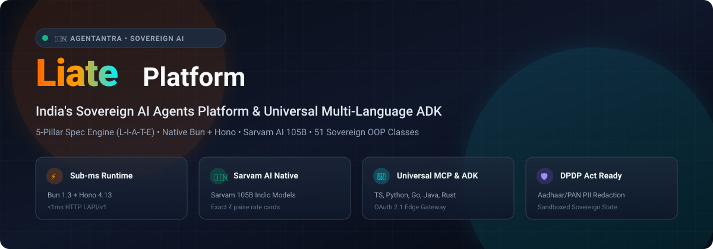
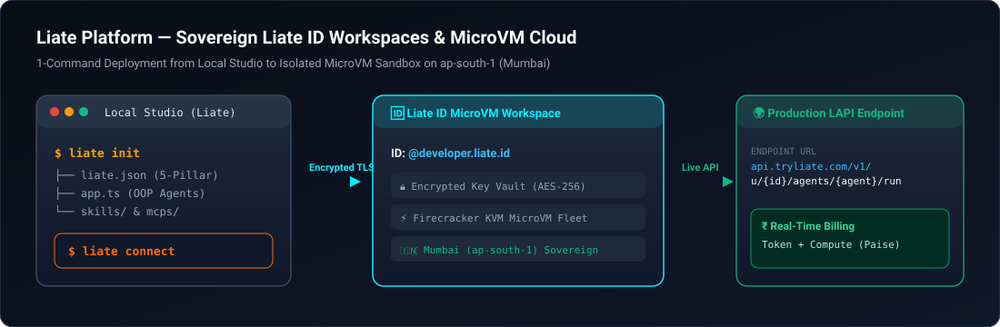
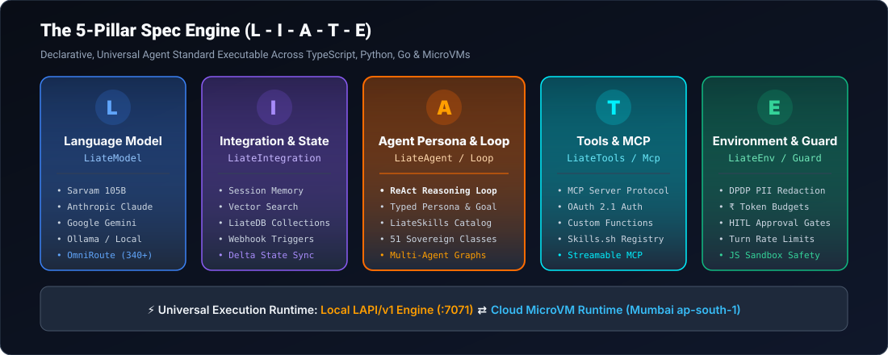

<p align="center">
  
</p>

<div align="center">

[](https://opensource.org/licenses/MIT)
[](https://www.npmjs.com/package/liate)
[](https://bun.sh)
[](https://hono.dev)
[](https://www.typescriptlang.org)
[](https://sarvam.ai)
[](https://testsprite.com)

> **Liate is a serverless runtime for building Sovereign AI Agents.**  
> *Not a framework. A runtime. Every Agent is an API. — BaaA (Backend as an Agent)*
>
> 🚀 **Liate has officially joined the [Sarvam AI Startup Program](https://sarvam.ai).**

</div>

---

---

## ⚡ Liate Platform: Sovereign Liate ID Workspaces for AI Agents

<p align="center">
  
</p>

### 🆔 The Liate ID Architecture

On the **Liate Platform**, every developer claims a unique **Liate ID** (e.g. `@vinod` / `vinod.liate.id`). Run `liate connect` to instantly link your local agents to your Liate ID workspace running inside an isolated MicroVM:

* **Isolated Per-User Compute:** Connect agents in 1 command (`liate connect`). Each agent executes in an isolated MicroVM sandbox tied to your Liate ID.
* **Isolated API Endpoints:** Every connected agent gets an instant production endpoint:  
  `https://api.tryliate.com/v1/u/{liate_id}/agents/{agent_name}`
* **Isolated Key Vaults & MCP Tools:** Your API keys (`SARVAM_API_KEY`, `OPENAI_API_KEY`), vector databases, and custom MCP connectors are encrypted and isolated per Liate ID.
* **1-Click Top-Up & Micro-payments:** Pay only for the exact token/compute consumption your agents use with real-time INR tracking.

---

## 🏛️ Architecture: The 5-Pillar Spec Engine ($L-I-A-T-E$)

<p align="center">
  
</p>

## 📦 Installation

Install Liate into your project using **Bun** (recommended) or **npm/pnpm/yarn**:

```bash
# Using Bun (Recommended)
bun add liate

# Using npm
npm install liate

# Install the Liate CLI globally
bun install -g liate
```

---

## 🏛️ What is Liate?

**Liate is a serverless runtime for building Sovereign AI Agents.**

This is not a framework you install on top of something else. Liate is the engine you **run ON** — the same way Bun is a runtime for JavaScript, Liate is a runtime for AI agents.

Write a 6-line OOP class → get a production-ready serverless backend with **35+ REST + WebSocket endpoints** at `LAPI/v1` — zero infrastructure, zero setup, zero framework overhead. **Every Agent is an API.**

India's Sovereign AI Stack has two layers:
- 🧠 **Sarvam AI** — The Brain: India's frontier foundation models (Sarvam 105B, Saaras, Bulbul)
- 🤲 **Liate** — The Hands: The native serverless runtime that runs those models as production AI agents

Part of the **Agentantra** mission — from *Swatantra* (1947 freedom) to *Agentantra* (2026 AI freedom). Open source. Free forever. **From Bengaluru, India — From Bharat To The World.**

---

## ⚡ Quickstart: 6-Line Sovereign Agent

Copy the environment template to configure your API keys (e.g. `SARVAM_API_KEY`):
```bash
cp .env.example .env
```

```typescript
import { liate, LiateModel, LiateAgent, LiateToken } from 'liate';

export default liate({
  // [L] Sovereign Language Model (India-first Sarvam AI)
  L: new LiateModel('sarvam/sarvam-105b'),

  // [A] Sovereign Agent Persona & Intent
  A: new LiateAgent('bharat-copilot', 'You are a sovereign business intelligence analyst.'),

  // [Token] Real INR Cost Tracking & Budget Guardrails
  Token: new LiateToken({
    budgetInr: 50.00, // ₹50 hard limit
    onCost: (cost) => console.log(`Burned: ₹${cost.totalInr.toFixed(4)}`)
  })
});
```

Run locally with instant sub-millisecond cold starts:
```bash
bun dev
# 🚀 Liate LAPI/v1 Engine listening on http://localhost:7071
```

---

## 🏛️ The 51 Sovereign Classes

Liate is architected across 8 decoupled, battle-tested layers:

```
Liate Framework Architecture (51 Sovereign Classes)
 │
 ├── 1. Agent Pillars — L-I-A-T-E Core (7 classes)
 │   ├── LiateModel        → [L] LLM Selector & Multi-Provider Router
 │   ├── LiateIntegration  → [I] Database, Memory Scope & Webhooks
 │   ├── LiateAgent        → [A] Persona, Skills & Intent Definition
 │   ├── LiateTools        → [T] MCP & TypeScript Tool Registry
 │   ├── LiateEnv          → [E] Guardrails, Approvals & API Keys
 │   ├── LiateApp          → Sovereign Multi-Agent Container
 │   └── LiateToken        → Real INR Token Rates (Sarvam) & Budgets
 │
 ├── 2. Orchestration & Async (9 classes)
 │   ├── LiateLoop         → ReAct Reasoning Loop & Step Iterator
 │   ├── LiateTask         → Tracked Async Background Job (202 Pattern)
 │   ├── LiateTaskManager  → Singleton Background Task Registry
 │   ├── LiateQueue        → Priority Job Queue with Retry Backoff
 │   ├── LiateCron         → Autonomous Scheduled Runner (Cron)
 │   ├── LiateWorkflow     → Sequential Pipeline Step Engine
 │   ├── LiateGraph        → DAG-Based Multi-Agent Graph Execution
 │   ├── LiateRoute        → Semantic & HTTP Intent Router
 │   └── LiateRun          → Agent Run Controller & Daemon Manager
 │
 ├── 3. Security & Identity (4 classes)
 │   ├── LiateGuard        → DPDP PII Redaction & Compliance Audit
 │   ├── LiateAuth         → HMAC-SHA256 API Key Auth & Token Guard
 │   ├── LiateSandbox      → Isolated JS Execution Sandbox
 │   └── LiatePlugin       → Plugin System & Lifecycle Hooks
 │
 ├── 4. AI Layer (4 classes)
 │   ├── LiateProvider     → Multi-Provider LLM Router & Rate Cards
 │   ├── LiateChat         → Multi-Turn Conversation Message Manager
 │   ├── LiateContext      → Agent Trace Context & Run Metadata
 │   └── LiateStream       → Async SSE Event Stream Iterator
 │
 ├── 5. Data & State (8 classes)
 │   ├── LiateDB           → In-Memory Document Store
 │   ├── LiateCollection   → Typed Generic Document Collection
 │   ├── LiateCrud         → Generic CRUD Wrapper
 │   ├── LiateMemory       → Long-Term Key-Value Fact Store
 │   ├── LiateSessions     → Multi-Turn Conversation Memory
 │   ├── LiateSessionHandle→ Individual Conversation Session Handle
 │   ├── LiateSync         → Distributed State Sync (multi-node)
 │   └── LiateVectorStore  → Semantic Vector Search Store
 │
 ├── 6. Built-In Capabilities (5 classes)
 │   ├── LiateVoice        → Indic STT/TTS (Sarvam Saaras + Bulbul)
 │   ├── LiateDoc          → Document Parse, OCR & Semantic Chunking
 │   ├── LiateCode         → AST Analysis & Syntax Validation Engine
 │   ├── LiateView         → Generative UI Component Builder
 │   └── LiateIO           → CSV / JSONL / TSV Ingest & Export
 │
 ├── 7. Networking & Protocol (7 classes)
 │   ├── LiateServer       → Embedded Hono HTTP + WebSocket Engine
 │   ├── LiateMcp          → Sovereign MCP Gateway & OAuth 2.1 Server
 │   ├── LiateWeb          → Consumer Client SDK (Next.js & Web Apps)
 │   ├── WSHub             → WebSocket Hub for HITL & Real-Time Streams
 │   ├── StreamableHttpClientTransport → MCP HTTP Transport Layer
 │   ├── LiateKey          → Encrypted API Key Vault
 │   └── LiateError        → Typed Sovereign Error Class
 │
 └── 8. Tooling & Developer Experience (7 classes)
     ├── LiateTest         → Mock LLM & CI/CD Agent Test Harness
     ├── LiateEval         → Quality Scorecard & Benchmark Runner
     ├── LiatePrompt       → Typed Prompt Template Engine
     ├── LiateDeploy       → Docker / MicroVM Deployment Generator
     ├── LiateBuild        → Bundle & Build System
     ├── LiateLogs         → Structured JSONL & OpenTelemetry OTLP Exporter
     └── LiateEvent        → Pub/Sub Event Bus
```

---

## 🇮🇳 India Sovereign AI: Sarvam AI Partnership

Liate natively integrates with **Sarvam AI** (official member of the Sarvam Startup Program), providing exact paise-level rate cards baked directly into `LiateToken`:

| Model / Service | Input (per 1M) | Cached (per 1M) | Output (per 1M) |
|---|---|---|---|
| **Sarvam 105B / Chat** | ₹29.28 | ₹10.98 | ₹73.20 |
| **Gemma-4 31B** | ₹36.60 | ₹13.73 | ₹91.50 |
| **GLM 5.2** | ₹128.10 | ₹23.79 | ₹402.60 |
| **Text to Speech (TTS)** | ₹3.00 / 1K chars | — | Real-time & Streaming |
| **Speech to Text (STT)** | ₹30.00 / hour | — | ₹45.00 / hr (Diarization) |
| **Doc AI** | ₹0.50 / page (Digitisation) | — | ₹1.00 / page (Extraction) |

---

## 🛠️ Liate CLI Reference

The `liate` CLI gives you complete control over agent lifecycle, local serving, cloud deployments, and vaults:

| Command | Description |
|---|---|
| `liate init` | Interactive 5-Pillar (L-I-A-T-E) project initialization wizard |
| `liate dev` / `liate serve` | Start local LAPI/v1 Hono server with hot-reloading (`:7071`) |
| `liate run <manifest>` | Execute any `.liate.json` or `.ts` agent directly from terminal |
| `liate connect` | Connect sovereign agent to your Liate ID MicroVM workspace |
| `liate key add/list/delete` | Manage encrypted API key vault |
| `liate mcp add/list/probe` | Inspect, register, and probe MCP connectors |
| `liate agents` | List all agents connected to your Liate ID MicroVM |
| `liate logs` | Live stream structured agent execution traces & telemetry |

---

## 🔌 API Endpoint Reference

Every `liate dev` server exposes **35+ REST + WebSocket endpoints** at `:7071`:

| Category | Endpoint | Description |
|---|---|---|
| Health | `GET /health` | Server liveness check |
| **Run** | `POST /lapi/v1/:agent_id/run` | Execute agent (ReAct loop) |
| Chat | `POST /api/chat` | Multi-turn streaming chat |
| Tasks | `POST /lapi/v1/:agent_id/tasks` | Dispatch async background task (202) |
| Tasks | `GET /lapi/v1/tasks/:task_id` | Poll task status & result |
| MCP | `ALL /lapi/v1/mcp` | JSON-RPC 2.0 MCP tool gateway |
| HITL | `POST /api/hitl/approve` | Human-in-the-loop tool approval |
| Catalog | `GET /api/catalog/:type` | Skills / LLM / MCP catalog |
| Keys | `POST /api/keys` | Save API key to vault |
| WebSocket | `WS /ws` | Real-time streaming + HITL approvals |

---

## 🔒 Security & Privacy

- **DPDP Act Ready**: Redact citizen PII (Aadhaar, PAN, phone numbers, UPI) via `LiateGuard`.
- **HMAC-SHA256 Auth**: API keys are hashed with HMAC-SHA256 via `LiateAuth` with dynamic salt generation.
- **Strict Sandboxing**: Isolated JS execution environment via `LiateSandbox` with stripped globals and execution timeouts.
- **Budget Guardrails**: Set hard spend limits in Indian Rupees (`₹`) via `LiateToken` to prevent runaway costs.
- **No Mock Data**: Every API call hits real endpoints — no silent fallbacks or fake data in production.

---

## 🧪 Testing & Continuous Verification

Liate is verified with a two-tier quality & testing pipeline:

- **Native Unit & Integration Suite**: 198 test cases across 15 test suites verifying all 51 OOP classes, ReAct reasoning loops, universal MCP server protocols, and token budgets (`bun test`).
- **Autonomous Cloud QA by TestSprite**: End-to-end browser workflows, API contracts, and availability verified by **[TestSprite](https://testsprite.com)** AI QA agents.

---

## ⚡ Production Runtime & Binary Performance

Liate is engineered for high-throughput, low-latency sovereign edge execution using the native Bun runtime:

| Distribution Target | Artifact | File Size | Description |
|---|---|---|---|
| **NPM Library Bundle** | `dist/index.js` | **`0.94 MB`** *(989 KB)* | Ultra-lean bundled JS. All 369 modules & 51 OOP classes bundled in under 1 MB. Instant sub-millisecond cold imports. |
| **Standalone Sovereign Binary** | `dist/liate` / `liate.exe` | **`94.80 MB`** | Single self-contained binary compiled via `bun build --compile`. Embeds full JavaScriptCore engine, SQLite, Hono, and LAPI/v1 runtime. Zero external dependencies required (no Node.js, Bun, or npm needed on host machine). |

### 🚀 Key Runtime Metrics

- **Binary Cold Boot**: **~430 ms** from zero to full CLI & server execution readiness.
- **LAPI/v1 HTTP Latency**: Sub-millisecond (`< 1ms`) response times on native routes.
- **Zero Python Overhead**: Unlike legacy Python agent frameworks requiring 500 MB – 2 GB virtual environments and slow warmups, Liate executes with instant native speed.

---

## 📜 License

MIT © 2026 Tryliate Team — Part of the Agentantra Sovereign AI Initiative.


